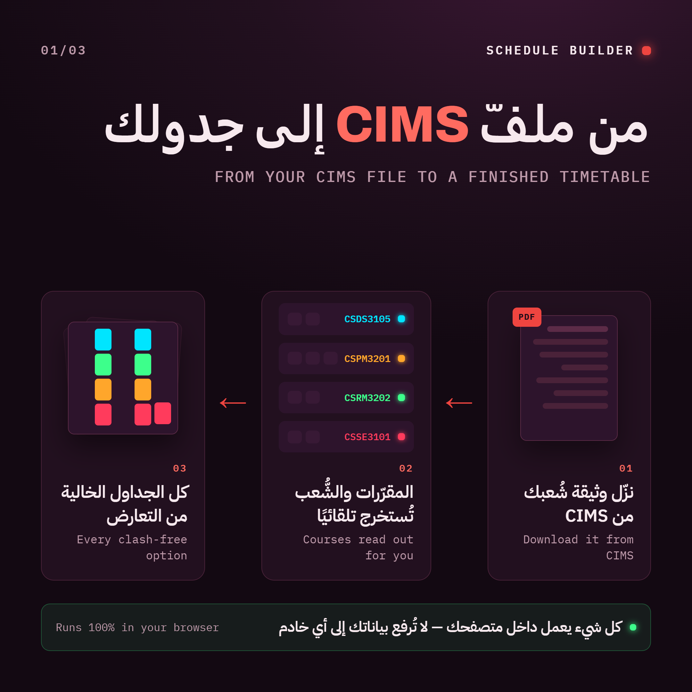
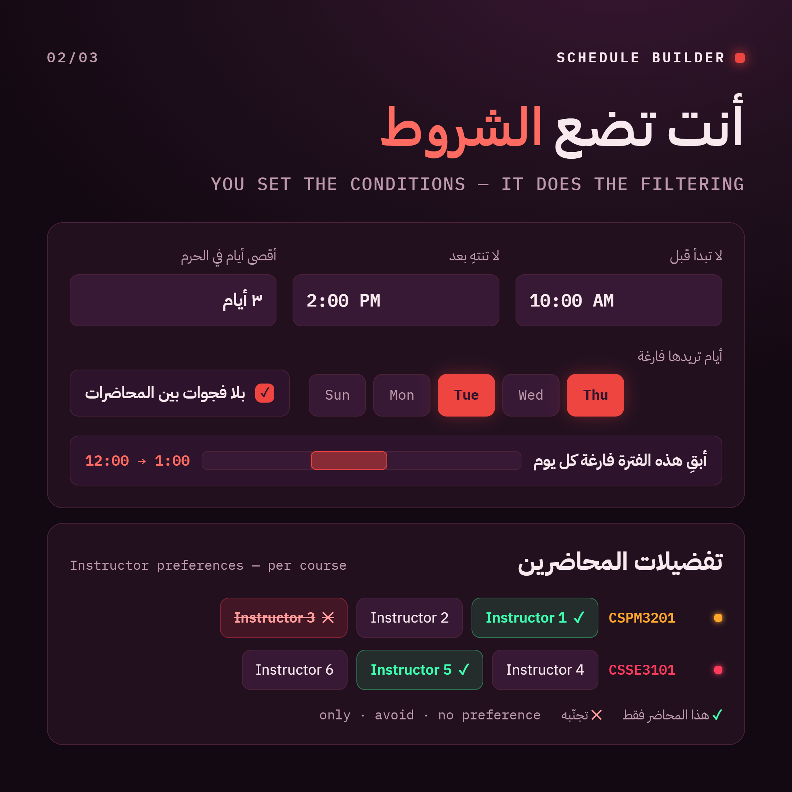
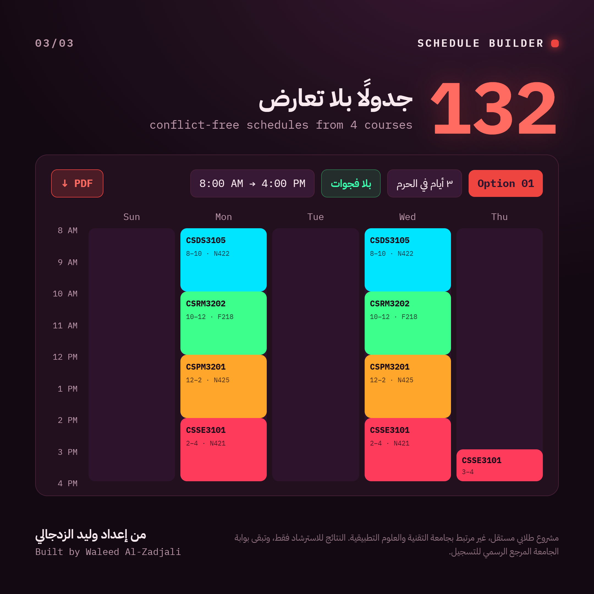

# Schedule Builder for

Pick your sections without the headache. Upload the timetable PDF from the college portal and the tool works out every conflict-free combination for you.

**[Try it](https://zadjali04.github.io/Schedule-Builder/)**

---

## Simple Overview

  

  

  

---

## What it does

- Reads the official **College Time Table** PDF and pulls out every course, section, time and room
- Generates all conflict-free schedules — no manual trial and error
- Filter by: earliest start, latest end, no gaps, days off, max days on campus, a daily free window, and instructor preferences
- Tells you **why** there are no results when your conditions are impossible
- Export any schedule as a PDF
- English / Arabic, light / dark

## How to use

1. Download your section timetable PDF from the portal
2. Open the tool and drop the PDF in
3. Set your conditions and browse the options

That's it. No sign-up, no account.

## Your file stays on your device

Everything runs inside your browser. The PDF is never uploaded anywhere — there's no server, no database, and nothing is saved. Close the tab and it's gone. You can test it yourself: turn off your internet after the page loads and it still works.

## Browser support

Use **Google Chrome**. Safari is not supported and will show a notice instead of loading.

## Built with vibe coding

This is a vibecoded tool !!!!

## Not official

Independent student project, made entirely on my own. **Not affiliated with, endorsed by, or an official service of the University of Technology and Applied Sciences.** Results are for guidance only — always confirm your final registration on the official portal.

## License

MIT — see [LICENSE](LICENSE).

## Share it

  

Built by **Waleed Al-Zadjali**
